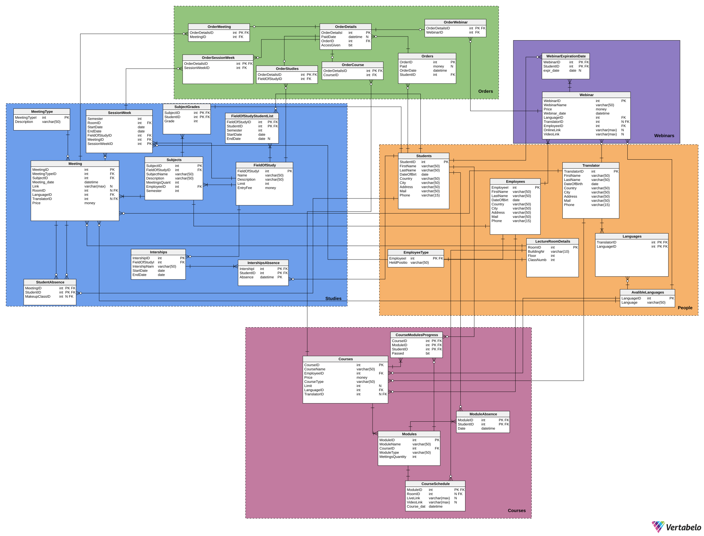

# Funkcjonalności systemu – lista użytkowników i ich uprawnienia

<p style="text-align: left; font-size: medium;"><br>Mokrzycki Filip,<br> Mateusz Wójcik,<br> Piotr Kacprzak </p>

## Uczestnik webinarów
1. Możliwość usunięcia swojego konta.  
2. Dostęp do listy dostępnych webinarów (cena, język, krótki opis).  
3. Możliwość zakupienia dostępu do płatnych webinarów.  
4. Informacja zwrotna o pomyślnym przeprowadzeniu płatności.  
5. Dostęp do opłaconych webinarów.  
6. Dostęp do linku z nagraniami webinarów.  
7. Możliwość złożenia wniosku do Dyrektora Szkoły w sprawie odstępstwa od regulaminu płatności.  

## Uczestnik kursów
1. Dostęp do informacji o godzinie, dacie i miejscu odbywania się kursu.  
2. Dostęp do listy kursów (ceny, język, typ, krótki opis).  
3. Wgląd do frekwencji, aktualnych postępów oraz wyników.  
4. Dostęp do nagrań kursów synchronicznych oraz asynchronicznych.  
5. Możliwość opłacenia kursu.  
6. Informacja zwrotna o pomyślnym przeprowadzeniu płatności.  
7. Możliwość złożenia wniosku do Dyrektora Szkoły w sprawie odstępstwa od regulaminu płatności.  

## Student
1. Dostęp do sylabusa.  
2. Dostęp do harmonogramu spotkań.  
3. Dostęp do informacji o godzinie, dacie i miejscu odbywania się zajęć.  
4. Wgląd do frekwencji, aktualnych postępów oraz wyników.  
5. Dostęp do informacji na temat praktyk.  
6. Informacja o sposobie odrobienia danej nieobecności.  
7. Możliwość opłacenia studium.  
8. Informacja zwrotna o pomyślnym przeprowadzeniu płatności.  
9. Możliwość złożenia wniosku do Dyrektora Szkoły w sprawie odstępstwa od regulaminu płatności.  

## Administrator
1. Możliwość usuwania webinarów.  
2. Możliwość tworzenia webinarów oraz kursów.  

## Dyrektor Szkoły
1. Wgląd do historii płatności użytkowników.  
2. Możliwość rozpatrzenia wniosków złożonych przez uczestników.  
3. Możliwość układania planu i dobierania wykładowców.  
4. Możliwość ustalania limitu miejsc dla kursów stacjonarnych oraz studiów.  

## Wykładowca
1. Dostęp do harmonogramu własnych zajęć.  
2. Wgląd do listy studentów.  
3. Możliwość sprawdzania obecności.  

## Potencjalny klient
1. Możliwość założenia konta na platformie.  
2. Dostęp do sylabusa.  
3. Dostęp do harmonogramu spotkań.  
4. Wgląd do kosztu pojedynczego spotkania studyjnego.  
5. Wgląd do kosztu webinaru, kursu, studium.  
6. Dostęp do listy webinarów (cena, język, krótki opis).  
7. Dostęp do listy kursów (ceny, język, typ, krótki opis).  

## Funkcjonalność bazy danych dla osób uprawnionych przez zleceniodawcę
1. Raporty finansowe – zestawienie przychodów dla każdego webinaru/kursu/studium.  
2. Lista „dłużników” – osoby, które skorzystały z usług, ale nie uiściły opłat.  
3. Raport dotyczący liczby zapisanych osób na przyszłe wydarzenia (z informacją, czy wydarzenie jest stacjonarne, czy zdalne).  
4. Raport dotyczący frekwencji na zakończonych już wydarzeniach.  
5. Lista obecności dla każdego szkolenia z datą, imieniem, nazwiskiem i informacją, czy uczestnik był obecny, czy nie.  
6. Raport bilokacji – lista osób, które są zapisane na co najmniej dwa przyszłe szkolenia, które kolidują czasowo.  


## Schemat bazy danych

<div style="text-align: center;">
  
</div>


## Kod do generowania bazy danych

```sql
-- Table: Courses
CREATE TABLE Courses (
    CourseID int NOT NULL,
    EmployeeID int NOT NULL,
    Price money NOT NULL,
    CourseType varchar(50) NOT NULL,
    Limit int NULL,
    LanguageID int NOT NULL,
    TranslatorID int NULL,
    ModulesQuantity int NOT NULL,
    CONSTRAINT Courses_pk PRIMARY KEY (CourseID),
    CONSTRAINT chk_Courses CHECK (
        LENGTH(CourseType) >= 1 AND
        Price >= 0 AND
        Limit >=0
    )
);

-- Reference: Courses_AvalibleLanguages (table: Courses)
ALTER TABLE Courses ADD CONSTRAINT Courses_AvalibleLanguages
    FOREIGN KEY (LanguageID)
    REFERENCES AvalibleLanguages (LanguageID);

-- Reference: Courses_Employees (table: Courses)
ALTER TABLE Courses ADD CONSTRAINT Courses_Employees
    FOREIGN KEY (EmployeeID)
    REFERENCES Employees (EmployeeID);

-- Reference: Courses_Translator (table: Courses)
ALTER TABLE Courses ADD CONSTRAINT Courses_Translator
    FOREIGN KEY (TranslatorID)
    REFERENCES Translator (TranslatorID);

-- Table: CourseModulesProgress
CREATE TABLE CourseModulesProgress (
    CourseID int  NOT NULL,
    ModuleID int  NOT NULL,
    StudentID int  NOT NULL,
    Passed bit  NOT NULL,
    CONSTRAINT CourseModulesProgress_pk PRIMARY KEY  (CourseID,ModuleID,StudentID)
);

-- Reference: CourseModulesProgress_Courses (table: CourseModulesProgress)
ALTER TABLE CourseModulesProgress ADD CONSTRAINT CourseModulesProgress_Courses
    FOREIGN KEY (CourseID)
    REFERENCES Courses (CourseID);

-- Reference: CourseModulesProgress_Modules (table: CourseModulesProgress)
ALTER TABLE CourseModulesProgress ADD CONSTRAINT CourseModulesProgress_Modules
    FOREIGN KEY (ModuleID)
    REFERENCES Modules (ModuleID);

-- Reference: CourseModulesProgress_Students (table: CourseModulesProgress)
ALTER TABLE CourseModulesProgress ADD CONSTRAINT CourseModulesProgress_Students
    FOREIGN KEY (StudentID)
    REFERENCES Students (StudentID);

-- Table: CourseSchedule
CREATE TABLE CourseSchedule (
    ModuleID int  NOT NULL,
    RoomID int  NULL,
    LiveLink varchar(max)  NULL,
    VideoLink varchar(max)  NULL,
    Course_date datetime  NOT NULL,
    CONSTRAINT CourseSchedule_pk PRIMARY KEY  (ModuleID)
);

-- Reference: CourseSchedule_LectureRoomDetails (table: CourseSchedule)
ALTER TABLE CourseSchedule ADD CONSTRAINT CourseSchedule_LectureRoomDetails
    FOREIGN KEY (RoomID)
    REFERENCES LectureRoomDetails (RoomID);

-- Reference: CourseSchedule_Modules (table: CourseSchedule)
ALTER TABLE CourseSchedule ADD CONSTRAINT CourseSchedule_Modules
    FOREIGN KEY (ModuleID)
    REFERENCES Modules (ModuleID);

-- Table: Modules
CREATE TABLE Modules (
    ModuleID int NOT NULL,
    ModuleName varchar(50) NOT NULL,
    CourseID int NOT NULL,
    ModuleType varchar(50) NOT NULL,
    MettingsQuantity int NOT NULL,
    CONSTRAINT Modules_pk PRIMARY KEY (ModuleID),
    CONSTRAINT chk_Modules CHECK (
        LENGTH(ModuleName) >= 1 AND
        MettingsQuantity > 0 AND
        LENGTH(ModuleType) >= 1
    )
);

-- Reference: Modules_Courses (table: Modules)
ALTER TABLE Modules ADD CONSTRAINT Modules_Courses
    FOREIGN KEY (CourseID)
    REFERENCES Courses (CourseID);

-- Table: ModuleAbsence
CREATE TABLE ModuleAbsence (
    ModuleID int  NOT NULL,
    StudentID int  NOT NULL,
    Date datetime  NOT NULL,
    CONSTRAINT ModuleAbsence_pk PRIMARY KEY  (ModuleID,StudentID)
);

-- Reference: ModuleAbsence_Modules (table: ModuleAbsence)
ALTER TABLE ModuleAbsence ADD CONSTRAINT ModuleAbsence_Modules
    FOREIGN KEY (ModuleID)
    REFERENCES Modules (ModuleID);

-- Reference: ModuleAbsence_Students (table: ModuleAbsence)
ALTER TABLE ModuleAbsence ADD CONSTRAINT ModuleAbsence_Students
    FOREIGN KEY (StudentID)
    REFERENCES Students (StudentID);

-- Table: Orders
CREATE TABLE Orders (
    OrderID int NOT NULL,
    Paid money NULL,
    OrderDate datetime NOT NULL,
    StudentID int NOT NULL,
    CONSTRAINT OrderID_pk PRIMARY KEY (OrderID),
    CONSTRAINT chk_Orders CHECK (
        Paid >= 0
    )
);

-- Reference: Orders_Students (table: Orders)
ALTER TABLE Orders ADD CONSTRAINT Orders_Students
    FOREIGN KEY (StudentID)
    REFERENCES Students (StudentID);

-- Table: OrderCourse
CREATE TABLE OrderCourse (
    OrderDetailsID int  NOT NULL,
    CourseID int  NOT NULL,
    CONSTRAINT OrderCourse_pk PRIMARY KEY  (OrderDetailsID)
);

-- Reference: OrderCourse_Courses (table: OrderCourse)
ALTER TABLE OrderCourse ADD CONSTRAINT OrderCourse_Courses
    FOREIGN KEY (CourseID)
    REFERENCES Courses (CourseID);

-- Reference: OrderCourse_OrderDetails (table: OrderCourse)
ALTER TABLE OrderCourse ADD CONSTRAINT OrderCourse_OrderDetails
    FOREIGN KEY (OrderDetailsID)
    REFERENCES OrderDetails (OrderDetailsID);

-- Table: OrderDetails
CREATE TABLE OrderDetails (
    OrderDetailsID int  NOT NULL,
    PaidDate datetime  NULL,
    OrderID int  NOT NULL,
    AccesGiven bit  NOT NULL,
    CONSTRAINT OrderDetails_pk PRIMARY KEY  (OrderDetailsID)
);

-- Reference: OrderDetails_Orders (table: OrderDetails)
ALTER TABLE OrderDetails ADD CONSTRAINT OrderDetails_Orders
    FOREIGN KEY (OrderID)
    REFERENCES Orders (OrderID);

-- Table: OrderMeeting
CREATE TABLE OrderMeeting (
    OrderDetailsID int  NOT NULL,
    MeetingID int  NOT NULL,
    CONSTRAINT OrderMeeting_pk PRIMARY KEY  (OrderDetailsID)
);

-- Reference: OrderMeeting_Meeting (table: OrderMeeting)
ALTER TABLE OrderMeeting ADD CONSTRAINT OrderMeeting_Meeting
    FOREIGN KEY (MeetingID)
    REFERENCES Meeting (MeetingID);

-- Reference: OrderMeeting_OrderDetails (table: OrderMeeting)
ALTER TABLE OrderMeeting ADD CONSTRAINT OrderMeeting_OrderDetails
    FOREIGN KEY (OrderDetailsID)
    REFERENCES OrderDetails (OrderDetailsID);

-- Table: OrderStudies
CREATE TABLE OrderStudies (
    OrderDetailsID int  NOT NULL,
    FieldOfStudyID int  NOT NULL,
    CONSTRAINT OrderStudies_pk PRIMARY KEY  (OrderDetailsID)
);

-- Reference: OrderStudies_FieldOfStudy (table: OrderStudies)
ALTER TABLE OrderStudies ADD CONSTRAINT OrderStudies_FieldOfStudy
    FOREIGN KEY (FieldOfStudyID)
    REFERENCES FieldOfStudy (FieldOfStudyID);

-- Reference: OrderStudies_OrderDetails (table: OrderStudies)
ALTER TABLE OrderStudies ADD CONSTRAINT OrderStudies_OrderDetails
    FOREIGN KEY (OrderDetailsID)
    REFERENCES OrderDetails (OrderDetailsID);

-- Table: OrderWebinar
CREATE TABLE OrderWebinar (
    OrderDetailsID int  NOT NULL,
    WebinarID int  NOT NULL,
    CONSTRAINT OrderWebinar_pk PRIMARY KEY  (OrderDetailsID)
);

-- Reference: OrderWebinar_OrderDetails (table: OrderWebinar)
ALTER TABLE OrderWebinar ADD CONSTRAINT OrderWebinar_OrderDetails
    FOREIGN KEY (OrderDetailsID)
    REFERENCES OrderDetails (OrderDetailsID);

-- Reference: OrderWebinar_Webinar (table: OrderWebinar)
ALTER TABLE OrderWebinar ADD CONSTRAINT OrderWebinar_Webinar
    FOREIGN KEY (WebinarID)
    REFERENCES Webinar (WebinarID);

-- Table: OrderSessionWeek
CREATE TABLE OrderSessionWeek (
    OrderDetailsID int  NOT NULL,
    SessionWeekID int  NOT NULL,
    CONSTRAINT OrderSessionWeek_pk PRIMARY KEY  (OrderDetailsID)
);

-- Reference: OrderSessionWeek_OrderDetails (table: OrderSessionWeek)
ALTER TABLE OrderSessionWeek ADD CONSTRAINT OrderSessionWeek_OrderDetails
    FOREIGN KEY (OrderDetailsID)
    REFERENCES OrderDetails (OrderDetailsID);

-- Reference: OrderSessionWeek_SessionWeek (table: OrderSessionWeek)
ALTER TABLE OrderSessionWeek ADD CONSTRAINT OrderSessionWeek_SessionWeek
    FOREIGN KEY (SessionWeekID)
    REFERENCES SessionWeek (SessionWeekID);

-- Table: Translator
CREATE TABLE Translator (
    TranslatorID int  NOT NULL,
    FirstName varchar(50)  NOT NULL,
    LastName varchar(50)  NOT NULL,
    DateOfBirth date  NOT NULL,
    Country varchar(50)  NOT NULL,
    City varchar(50)  NOT NULL,
    Address varchar(50)  NOT NULL,
    Mail varchar(50)  NOT NULL,
    Phone varchar(15)  NOT NULL,
    CONSTRAINT Translator_pk PRIMARY KEY  (TranslatorID)
    CONSTRAINT chk_translator_validations CHECK (
        DATEDIFF(CURDATE(), DateOfBirth) / 365.25 >= 18 AND
        LENGTH(FirstName) >= 1 AND
        LENGTH(LastName) >= 1 AND
        LENGTH(Country) >= 1 AND
        LENGTH(City) >= 1 AND
        LENGTH(Address) >= 1 AND
        LENGTH(Mail) >= 1 AND
        LENGTH(Phone) >= 1
    )
);

-- Table: Employees
CREATE TABLE Employees (
    EmployeeID int  NOT NULL IDENTITY,
    FirstName varchar(50)  NOT NULL,
    LastName varchar(50)  NOT NULL,
    DateOfBirth date  NOT NULL,
    Country varchar(50)  NOT NULL,
    City varchar(50)  NOT NULL,
    Address varchar(50)  NOT NULL,
    Mail varchar(50)  NOT NULL,
    Phone varchar(15)  NOT NULL,
    CONSTRAINT Employees_pk PRIMARY KEY  (EmployeeID),
    CONSTRAINT chk_Employees CHECK (
        DATEDIFF(CURDATE(), DateOfBirth) / 365.25 >= 18 AND
        LENGTH(FirstName) >= 1 AND
        LENGTH(LastName) >= 1 AND
        LENGTH(Country) >= 1 AND
        LENGTH(City) >= 1 AND
        LENGTH(Address) >= 1 AND
        LENGTH(Mail) >= 1 AND
        LENGTH(Phone) >= 1
    )
);

-- Table: EmployeeType
CREATE TABLE EmployeeType (
    EmployeeID int NOT NULL,
    HeldPosition varchar(50) NOT NULL,
    CONSTRAINT EmployeeType_pk PRIMARY KEY (EmployeeID),
    CONSTRAINT chk_EmployeeType CHECK (
        LENGTH(HeldPosition) >= 1
    )
);

-- Reference: EmployeeType_Employees (table: EmployeeType)
ALTER TABLE EmployeeType ADD CONSTRAINT EmployeeType_Employees
    FOREIGN KEY (EmployeeID)
    REFERENCES Employees (EmployeeID);

-- Table: Students
CREATE TABLE Students (
    StudentID int  NOT NULL IDENTITY,
    FirstName varchar(50)  NOT NULL,
    LastName varchar(50)  NOT NULL,
    DateOfBirth date  NOT NULL,
    Country varchar(50)  NOT NULL,
    City varchar(50)  NOT NULL,
    Address varchar(50)  NOT NULL,
    Mail varchar(50)  NOT NULL,
    Phone varchar(15)  NOT NULL,
    CONSTRAINT Students_pk PRIMARY KEY  (StudentID),
    CONSTRAINT chk_Students CHECK (
        DATEDIFF(CURDATE(), DateOfBirth) / 365.25 >= 16 AND
        LENGTH(FirstName) >= 1 AND
        LENGTH(LastName) >= 1 AND
        LENGTH(Country) >= 1 AND
        LENGTH(City) >= 1 AND
        LENGTH(Address) >= 1 AND
        LENGTH(Mail) >= 1 AND
        LENGTH(Phone) >= 1
    )
);


-- Table: LectureRoomDetails
CREATE TABLE LectureRoomDetails (
    RoomID int NOT NULL,
    BuildingNr varchar(10) NOT NULL,
    Floor int NOT NULL,
    ClassNumber int NOT NULL,
    CONSTRAINT LectureRoomDetails_pk PRIMARY KEY (RoomID),
    CONSTRAINT chk_LectureRoomDetails CHECK (
        LENGTH(BuildingNr) >= 1 AND
        ClassNumber >= 0
    )
);

-- Table: Languages
CREATE TABLE Languages (
    TranslatorID int  NOT NULL,
    LanguageID int  NOT NULL,
    CONSTRAINT LanguageID_pk PRIMARY KEY  (TranslatorID,LanguageID)
);

-- Reference: Languages_AvalibleLanguages (table: Languages)
ALTER TABLE Languages ADD CONSTRAINT Languages_AvalibleLanguages
    FOREIGN KEY (LanguageID)
    REFERENCES AvalibleLanguages (LanguageID);

-- Reference: Languages_Translator (table: Languages)
ALTER TABLE Languages ADD CONSTRAINT Languages_Translator
    FOREIGN KEY (TranslatorID)
    REFERENCES Translator (TranslatorID);

-- Table: AvalibleLanguages
CREATE TABLE AvalibleLanguages (
    LanguageID int NOT NULL,
    Language varchar(50) NOT NULL,
    CONSTRAINT AvalibleLanguages_pk PRIMARY KEY (LanguageID),
    CONSTRAINT chk_AvalibleLanguages CHECK (
        LENGTH(Language) >= 1
    )
);

-- Table: FieldOfStudy
CREATE TABLE FieldOfStudy (
    FieldOfStudyID int NOT NULL,
    Name varchar(50) NOT NULL,
    Description varchar(50) NOT NULL,
    Limit int NOT NULL,
    EntryFee money NOT NULL,
    CONSTRAINT FieldOfStudy_pk PRIMARY KEY (FieldOfStudyID),
    CONSTRAINT chk_FieldOfStudy CHECK (
        LENGTH(Name) >= 1 AND
        LENGTH(Description) >= 1 AND
        EntryFee >= 0 AND
        Limit >= 0
    )
);

-- Table: FieldOfStudyStudentList
CREATE TABLE FieldOfStudyStudentList (
    FieldOfStudyID int NOT NULL,
    StudentID int NOT NULL,
    Semester int NOT NULL,
    StartDate date NOT NULL,
    EndDate date NULL,
    CONSTRAINT FieldOfStudyStudentList_pk PRIMARY KEY (StudentID, FieldOfStudyID),
    CONSTRAINT chk_FieldOfStudyStudentList CHECK (
        Semester >= 0 AND
        (EndDate IS NULL OR StartDate < EndDate)
    )
);

-- Reference: FieldOfStudyStudentList_FieldOfStudy (table: FieldOfStudyStudentList)
ALTER TABLE FieldOfStudyStudentList ADD CONSTRAINT FieldOfStudyStudentList_FieldOfStudy
    FOREIGN KEY (FieldOfStudyID)
    REFERENCES FieldOfStudy (FieldOfStudyID);

-- Reference: FieldOfStudyStudentList_Students (table: FieldOfStudyStudentList)
ALTER TABLE FieldOfStudyStudentList ADD CONSTRAINT FieldOfStudyStudentList_Students
    FOREIGN KEY (StudentID)
    REFERENCES Students (StudentID);

-- Table: Subjects
CREATE TABLE Subjects (
    SubjectID int NOT NULL,
    FieldOfStudyID int NOT NULL,
    SubjectName varchar(50) NOT NULL,
    Description varchar(50) NOT NULL,
    MeetingsQuantity int NOT NULL,
    EmployeeID int NOT NULL,
    Semester int NOT NULL,
    CONSTRAINT Subjects_pk PRIMARY KEY (SubjectID),
    CONSTRAINT chk_Subjects CHECK (
        LENGTH(SubjectName) >= 1 AND
        LENGTH(Description) >= 1 AND
        MeetingsQuantity > 0 AND
        Semester >= 0
    )
);

-- Reference: Subjects_Employees (table: Subjects)
ALTER TABLE Subjects ADD CONSTRAINT Subjects_Employees
    FOREIGN KEY (EmployeeID)
    REFERENCES Employees (EmployeeID);

-- Reference: Subjects_FieldOfStudy (table: Subjects)
ALTER TABLE Subjects ADD CONSTRAINT Subjects_FieldOfStudy
    FOREIGN KEY (FieldOfStudyID)
    REFERENCES FieldOfStudy (FieldOfStudyID);


-- Table: SubjectGrades
CREATE TABLE SubjectGrades (
    SubjectID int NOT NULL,
    StudentID int NOT NULL,
    Grade int NOT NULL,
    CONSTRAINT SubjectGrades_pk PRIMARY KEY (SubjectID, StudentID),
    CONSTRAINT chk_SubjectGrades CHECK (
        Grade >= 0
    )
);

-- Reference: SubjectGrades_Students (table: SubjectGrades)
ALTER TABLE SubjectGrades ADD CONSTRAINT SubjectGrades_Students
    FOREIGN KEY (StudentID)
    REFERENCES Students (StudentID);

-- Reference: SubjectGrades_Subjects (table: SubjectGrades)
ALTER TABLE SubjectGrades ADD CONSTRAINT SubjectGrades_Subjects
    FOREIGN KEY (SubjectID)
    REFERENCES Subjects (SubjectID);

-- Table: Meeting
CREATE TABLE Meeting (
    MeetingID int NOT NULL,
    MeetingTypeID int NOT NULL,
    SubjectID int NOT NULL,
    Meeting_date datetime NOT NULL,
    Link varchar(max) NULL,
    RoomID int NULL,
    LanguageID int NOT NULL,
    TranslatorID int NULL,
    Price money NOT NULL,
    CONSTRAINT Meeting_pk PRIMARY KEY (MeetingID),
    CONSTRAINT chk_Meeting CHECK (
        Price >= 0
    )
);

-- Reference: Meeting_LectureRoomDetails (table: Meeting)
ALTER TABLE Meeting ADD CONSTRAINT Meeting_LectureRoomDetails
    FOREIGN KEY (RoomID)
    REFERENCES LectureRoomDetails (RoomID);

-- Reference: Meeting_AvalibleLanguages (table: Meeting)
ALTER TABLE Meeting ADD CONSTRAINT Meeting_AvalibleLanguages
    FOREIGN KEY (LanguageID)
    REFERENCES AvalibleLanguages (LanguageID);

-- Reference: Meeting_MeetingType (table: Meeting)
ALTER TABLE Meeting ADD CONSTRAINT Meeting_MeetingType
    FOREIGN KEY (MeetingTypeID)
    REFERENCES MeetingType (MeetingTypeID);

-- Reference: Meeting_Subjects (table: Meeting)
ALTER TABLE Meeting ADD CONSTRAINT Meeting_Subjects
    FOREIGN KEY (SubjectID)
    REFERENCES Subjects (SubjectID);

-- Reference: Meeting_Translator (table: Meeting)
ALTER TABLE Meeting ADD CONSTRAINT Meeting_Translator
    FOREIGN KEY (TranslatorID)
    REFERENCES Translator (TranslatorID);

-- Table: StudentAbsence
CREATE TABLE StudentAbsence (
    MeetingID int  NOT NULL,
    StudentID int  NOT NULL,
    MakeupClassID int  NULL,
    CONSTRAINT StudentAbsence_pk PRIMARY KEY  (MeetingID,StudentID)
);

-- Reference: StudentAbsence_Meeting (table: StudentAbsence)
ALTER TABLE StudentAbsence ADD CONSTRAINT StudentAbsence_Meeting
    FOREIGN KEY (MeetingID)
    REFERENCES Meeting (MeetingID);

-- Reference: StudentAbsence_Meeting (table: StudentAbsence)
ALTER TABLE StudentAbsence ADD CONSTRAINT StudentAbsence_Meeting
    FOREIGN KEY (MakeupClassID)
    REFERENCES Meeting (MeetingID);

-- Reference: StudentAbsence_Students (table: StudentAbsence)
ALTER TABLE StudentAbsence ADD CONSTRAINT StudentAbsence_Students
    FOREIGN KEY (StudentID)
    REFERENCES Students (StudentID);

-- Table: Interships
CREATE TABLE Interships (
    IntershipID int NOT NULL,
    FieldOfStudyID int NOT NULL,
    IntershipName varchar(50) NOT NULL,
    StartDate date NOT NULL,
    EndDate date NOT NULL,
    CONSTRAINT Interships_pk PRIMARY KEY (IntershipID),
    CONSTRAINT chk_Interships CHECK (
        LENGTH(IntershipName) >= 1 AND
        StartDate < EndDate
    )
);

-- Reference: Interships_FieldOfStudy (table: Interships)
ALTER TABLE Interships ADD CONSTRAINT Interships_FieldOfStudy
    FOREIGN KEY (FieldOfStudyID)
    REFERENCES FieldOfStudy (FieldOfStudyID);

-- Table: IntershipsAbsence
CREATE TABLE IntershipsAbsence (
    IntershipID int  NOT NULL,
    StudentID int  NOT NULL,
    Absence datetime  NOT NULL,
    CONSTRAINT IntershipsAbsence_pk PRIMARY KEY  (IntershipID,StudentID,Absence)
);

-- Reference: IntershipsAbsence_Interships (table: IntershipsAbsence)
ALTER TABLE IntershipsAbsence ADD CONSTRAINT IIntershipsAbsence_Interships
    FOREIGN KEY (IntershipID)
    REFERENCES Interships (IntershipID);

-- Reference: IntershipsAbsence_Students (table: IntershipsAbsence)
ALTER TABLE IntershipsAbsence ADD CONSTRAINT IntershipsAbsence_Students
    FOREIGN KEY (StudentID)
    REFERENCES Students (StudentID);

-- Table: SessionWeek
CREATE TABLE SessionWeek (
    Semester int NOT NULL,
    RoomID int NOT NULL,
    StartDate date NOT NULL,
    EndDate date NOT NULL,
    FieldOfStudyID int NOT NULL,
    MeetingID int NOT NULL,
    SessionWeekID int NOT NULL,
    CONSTRAINT SessionWeek_pk PRIMARY KEY (SessionWeekID),
    CONSTRAINT chk_SessionWeek CHECK (
        StartDate < EndDate AND
        Semester >= 0
    )
);

-- Reference: SessionWeek_FieldOfStudy (table: SessionWeek)
ALTER TABLE SessionWeek ADD CONSTRAINT SessionWeek_FieldOfStudy
    FOREIGN KEY (FieldOfStudyID)
    REFERENCES FieldOfStudy (FieldOfStudyID);

-- Reference: SessionWeek_Meeting (table: SessionWeek)
ALTER TABLE SessionWeek ADD CONSTRAINT SessionWeek_Meeting
    FOREIGN KEY (MeetingID)
    REFERENCES Meeting (MeetingID);

-- Reference: SessionWeek_LectureRoomDetails (table: SessionWeek)
ALTER TABLE SessionWeek ADD CONSTRAINT SessionWeek_LectureRoomDetails
    FOREIGN KEY (RoomID)
    REFERENCES LectureRoomDetails (RoomID);

-- Table: MeetingType
CREATE TABLE MeetingType (
    MeetingTypeID int NOT NULL,
    Description varchar(50) NOT NULL,
    CONSTRAINT MeetingType_pk PRIMARY KEY (MeetingTypeID),
    CONSTRAINT chk_MeetingType CHECK (
        LENGTH(Description) >= 1
    )
);

-- Table: Webinar
CREATE TABLE Webinar (
    WebinarID int  NOT NULL,
    WebinarName varchar(50)  NOT NULL,
    Price money  NOT NULL,
    Webinar_date datetime  NOT NULL,
    LanguageID int  NOT NULL,
    TranslatorID int  NULL,
    EmployeeID int  NOT NULL,
    OnlineLink varchar(max)  NULL,
    VideoLink varchar(max)  NULL,
    CONSTRAINT Webinar_pk PRIMARY KEY  (WebinarID)
    CONSTRAINT chk_Webinar CHECK (Price >= 0 and LENGTH(WebinarName) >= 1)
);

-- Reference: Webinar_AvalibleLanguages (table: Webinar)
ALTER TABLE Webinar ADD CONSTRAINT Webinar_AvalibleLanguages
    FOREIGN KEY (LanguageID)
    REFERENCES AvalibleLanguages (LanguageID);

-- Reference: Webinar_Employees (table: Webinar)
ALTER TABLE Webinar ADD CONSTRAINT Webinar_Employees
    FOREIGN KEY (EmployeeID)
    REFERENCES Employees (EmployeeID);

-- Reference: Webinar_Translator (table: Webinar)
ALTER TABLE Webinar ADD CONSTRAINT Webinar_Translator
    FOREIGN KEY (TranslatorID)
    REFERENCES Translator (TranslatorID);

-- Table: WebinarExpirationDate
CREATE TABLE WebinarExpirationDate (
    WebinarID int  NOT NULL,
    StudentID int  NOT NULL,
    expr_date date  NULL,
    CONSTRAINT WebinarExpirationDate_pk PRIMARY KEY  (WebinarID,StudentID)
);

-- Reference: WebinarExpirationDate_Students (table: WebinarExpirationDate)
ALTER TABLE WebinarExpirationDate ADD CONSTRAINT WebinarExpirationDate_Students
    FOREIGN KEY (StudentID)
    REFERENCES Students (StudentID);

-- Reference: WebinarExpirationDate_Webinar (table: WebinarExpirationDate)
ALTER TABLE WebinarExpirationDate ADD CONSTRAINT WebinarExpirationDate_Webinar
    FOREIGN KEY (WebinarID)
    REFERENCES Webinar (WebinarID);

```