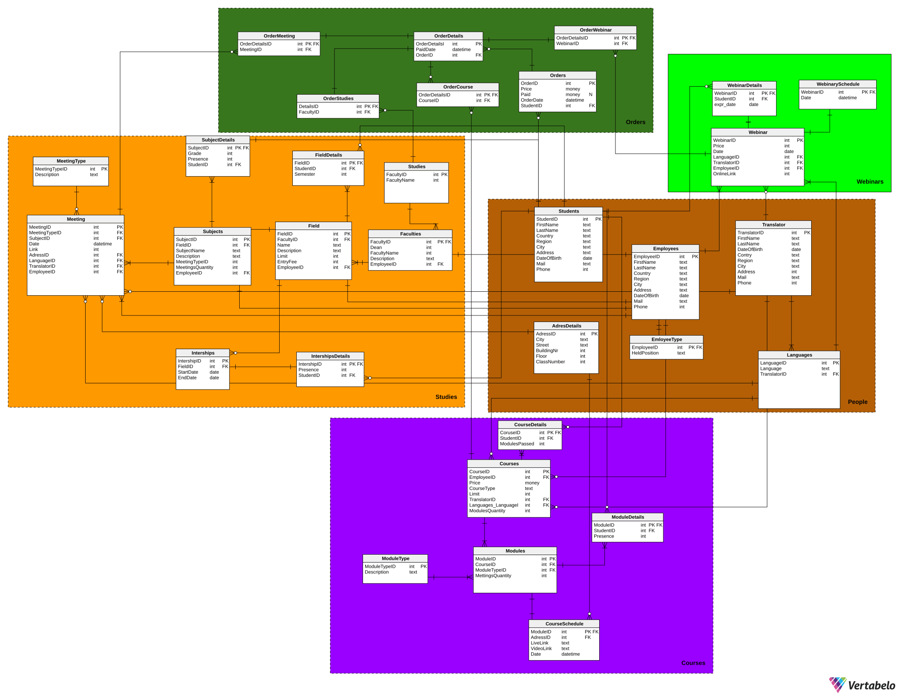

# Funkcjonalności systemu – lista użytkowników i ich uprawnienia

<p style="text-align: center; font-size: medium;"><br>Mokrzycki Filip,<br> Mateusz Wójcik,<br> Piotr Kacprzak </p>

## Uczestnik webinarów
1. Możliwość usunięcia swojego konta.  
2. Dostęp do listy dostępnych webinarów (cena, język, krótki opis).  
3. Możliwość zakupienia dostępu do płatnych webinarów.  
4. Informacja zwrotna o pomyślnym przeprowadzeniu płatności.  
5. Dostęp do opłaconych webinarów.  
6. Dostęp do linku z nagraniami webinarów.  
7. Możliwość złożenia wniosku do Dyrektora Szkoły w sprawie odstępstwa od regulaminu płatności.  

## Uczestnik kursów
1. Dostęp do informacji o godzinie, dacie i miejscu odbywania się kursu.  
2. Dostęp do listy kursów (ceny, język, typ, krótki opis).  
3. Wgląd do frekwencji, aktualnych postępów oraz wyników.  
4. Dostęp do nagrań kursów synchronicznych oraz asynchronicznych.  
5. Możliwość opłacenia kursu.  
6. Informacja zwrotna o pomyślnym przeprowadzeniu płatności.  
7. Możliwość złożenia wniosku do Dyrektora Szkoły w sprawie odstępstwa od regulaminu płatności.  

## Student
1. Dostęp do sylabusa.  
2. Dostęp do harmonogramu spotkań.  
3. Dostęp do informacji o godzinie, dacie i miejscu odbywania się zajęć.  
4. Wgląd do frekwencji, aktualnych postępów oraz wyników.  
5. Dostęp do informacji na temat praktyk.  
6. Informacja o sposobie odrobienia danej nieobecności.  
7. Możliwość opłacenia studium.  
8. Informacja zwrotna o pomyślnym przeprowadzeniu płatności.  
9. Możliwość złożenia wniosku do Dyrektora Szkoły w sprawie odstępstwa od regulaminu płatności.  

## Administrator
1. Możliwość usuwania webinarów.  
2. Możliwość tworzenia webinarów oraz kursów.  

## Dyrektor Szkoły
1. Wgląd do historii płatności użytkowników.  
2. Możliwość rozpatrzenia wniosków złożonych przez uczestników.  
3. Możliwość układania planu i dobierania wykładowców.  
4. Możliwość ustalania limitu miejsc dla kursów stacjonarnych oraz studiów.  

## Wykładowca
1. Dostęp do harmonogramu własnych zajęć.  
2. Wgląd do listy studentów.  
3. Możliwość sprawdzania obecności.  

## Potencjalny klient
1. Możliwość założenia konta na platformie.  
2. Dostęp do sylabusa.  
3. Dostęp do harmonogramu spotkań.  
4. Wgląd do kosztu pojedynczego spotkania studyjnego.  
5. Wgląd do kosztu webinaru, kursu, studium.  
6. Dostęp do listy webinarów (cena, język, krótki opis).  
7. Dostęp do listy kursów (ceny, język, typ, krótki opis).  

## Funkcjonalność bazy danych dla osób uprawnionych przez klienta
1. Raporty finansowe – zestawienie przychodów dla każdego webinaru/kursu/studium.  
2. Lista „dłużników” – osoby, które skorzystały z usług, ale nie uiściły opłat.  
3. Raport dotyczący liczby zapisanych osób na przyszłe wydarzenia (z informacją, czy wydarzenie jest stacjonarne, czy zdalne).  
4. Raport dotyczący frekwencji na zakończonych już wydarzeniach.  
5. Lista obecności dla każdego szkolenia z datą, imieniem, nazwiskiem i informacją, czy uczestnik był obecny, czy nie.  
6. Raport bilokacji – lista osób, które są zapisane na co najmniej dwa przyszłe szkolenia, które kolidują czasowo.  


## Schemat bazy danych

<p align="center">

</p>


## Kod do generowania bazy danych

```sql
-- tables
-- Table: AdresDetails
CREATE TABLE AdresDetails (
    AdressID int  NOT NULL,
    City text  NOT NULL,
    Street text  NOT NULL,
    BuildingNr int  NOT NULL,
    Floor int  NOT NULL,
    ClassNumber int  NOT NULL,
    CONSTRAINT AdresDetails_pk PRIMARY KEY  (AdressID)
);

-- Table: CourseDetails
CREATE TABLE CourseDetails (
    CoruseID int  NOT NULL,
    StudentID int  NOT NULL,
    ModulesPassed int  NOT NULL,
    CONSTRAINT CourseDetails_pk PRIMARY KEY  (CoruseID)
);

-- Table: CourseSchedule
CREATE TABLE CourseSchedule (
    ModuleID int  NOT NULL,
    AdressID int  NOT NULL,
    LiveLink text  NOT NULL,
    VideoLink text  NOT NULL,
    Date datetime  NOT NULL,
    CONSTRAINT CourseSchedule_pk PRIMARY KEY  (ModuleID)
);

-- Table: Courses
CREATE TABLE Courses (
    CourseID int  NOT NULL,
    EmployeeID int  NOT NULL,
    Price money  NOT NULL,
    CourseType text  NOT NULL,
    Limit int  NOT NULL,
    TranslatorID int  NOT NULL,
    Languages_LanguageID int  NOT NULL,
    ModulesQuantity int  NOT NULL,
    CONSTRAINT Courses_pk PRIMARY KEY  (CourseID)
);

-- Table: EmloyeeType
CREATE TABLE EmloyeeType (
    EmployeeID int  NOT NULL,
    HeldPosition text  NOT NULL,
    CONSTRAINT EmloyeeType_pk PRIMARY KEY  (EmployeeID)
);

-- Table: Employees
CREATE TABLE Employees (
    EmployeeID int  NOT NULL IDENTITY,
    FirstName text  NOT NULL,
    LastName text  NOT NULL,
    Country text  NOT NULL,
    Region text  NOT NULL,
    City text  NOT NULL,
    Address text  NOT NULL,
    DateOfBirth date  NOT NULL,
    Mail text  NOT NULL,
    Phone int  NOT NULL,
    CONSTRAINT Employees_pk PRIMARY KEY  (EmployeeID)
);

-- Table: Faculties
CREATE TABLE Faculties (
    FacultyID int  NOT NULL,
    Dean int  NOT NULL,
    FacultyName int  NOT NULL,
    Description text  NOT NULL,
    EmployeeID int  NOT NULL,
    CONSTRAINT Faculties_pk PRIMARY KEY  (FacultyID)
);

-- Table: Field
CREATE TABLE Field (
    FieldID int  NOT NULL,
    FacultyID int  NOT NULL,
    Name text  NOT NULL,
    Description text  NOT NULL,
    Limit int  NOT NULL,
    EntryFee int  NOT NULL,
    EmployeeID int  NOT NULL,
    CONSTRAINT Field_pk PRIMARY KEY  (FieldID)
);

-- Table: FieldDetails
CREATE TABLE FieldDetails (
    FieldID int  NOT NULL,
    StudentID int  NOT NULL,
    Semester int  NOT NULL,
    CONSTRAINT FieldDetails_pk PRIMARY KEY  (FieldID)
);

-- Table: Interships
CREATE TABLE Interships (
    IntershipID int  NOT NULL,
    FieldID int  NOT NULL,
    StartDate date  NOT NULL,
    EndDate date  NOT NULL,
    CONSTRAINT Interships_pk PRIMARY KEY  (IntershipID)
);

-- Table: IntershipsDetails
CREATE TABLE IntershipsDetails (
    IntershipID int  NOT NULL,
    Presence int  NOT NULL,
    StudentID int  NOT NULL,
    CONSTRAINT IntershipsDetails_pk PRIMARY KEY  (IntershipID)
);

-- Table: Languages
CREATE TABLE Languages (
    LanguageID int  NOT NULL,
    Language text  NOT NULL,
    TranslatorID int  NOT NULL,
    CONSTRAINT LanguageID PRIMARY KEY  (LanguageID)
);

-- Table: Meeting
CREATE TABLE Meeting (
    MeetingID int  NOT NULL,
    MeetingTypeID int  NOT NULL,
    SubjectID int  NOT NULL,
    Date datetime  NOT NULL,
    Link int  NOT NULL,
    AdressID int  NOT NULL,
    LanguageID int  NOT NULL,
    TranslatorID int  NOT NULL,
    EmployeeID int  NOT NULL,
    CONSTRAINT Meeting_pk PRIMARY KEY  (MeetingID)
);

-- Table: MeetingType
CREATE TABLE MeetingType (
    MeetingTypeID int  NOT NULL,
    Description text  NOT NULL,
    CONSTRAINT MeetingType_pk PRIMARY KEY  (MeetingTypeID)
);

-- Table: ModuleDetails
CREATE TABLE ModuleDetails (
    ModuleID int  NOT NULL,
    StudentID int  NOT NULL,
    Presence int  NOT NULL,
    CONSTRAINT ModuleDetails_pk PRIMARY KEY  (ModuleID)
);

-- Table: ModuleType
CREATE TABLE ModuleType (
    ModuleTypeID int  NOT NULL,
    Description text  NOT NULL,
    CONSTRAINT ModuleType_pk PRIMARY KEY  (ModuleTypeID)
);

-- Table: Modules
CREATE TABLE Modules (
    ModuleID int  NOT NULL,
    CourseID int  NOT NULL,
    ModuleTypeID int  NOT NULL,
    MettingsQuantity int  NOT NULL,
    CONSTRAINT Modules_pk PRIMARY KEY  (ModuleID)
);

-- Table: OrderCourse
CREATE TABLE OrderCourse (
    OrderDetailsID int  NOT NULL,
    CourseID int  NOT NULL,
    CONSTRAINT OrderCourse_pk PRIMARY KEY  (OrderDetailsID)
);

-- Table: OrderDetails
CREATE TABLE OrderDetails (
    OrderDetailsID int  NOT NULL,
    PaidDate datetime  NOT NULL,
    OrderID int  NOT NULL,
    CONSTRAINT OrderDetails_pk PRIMARY KEY  (OrderDetailsID)
);

-- Table: OrderMeeting
CREATE TABLE OrderMeeting (
    OrderDetailsID int  NOT NULL,
    MeetingID int  NOT NULL,
    CONSTRAINT OrderMeeting_pk PRIMARY KEY  (OrderDetailsID)
);

-- Table: OrderStudies
CREATE TABLE OrderStudies (
    DetailsID int  NOT NULL,
    FacultyID int  NOT NULL,
    CONSTRAINT OrderStudies_pk PRIMARY KEY  (DetailsID)
);

-- Table: OrderWebinar
CREATE TABLE OrderWebinar (
    OrderDetailsID int  NOT NULL,
    WebinarID int  NOT NULL,
    CONSTRAINT OrderWebinar_pk PRIMARY KEY  (OrderDetailsID)
);

-- Table: Orders
CREATE TABLE Orders (
    OrderID int  NOT NULL,
    Price money  NOT NULL,
    Paid money  NULL,
    OrderDate datetime  NOT NULL,
    StudentID int  NOT NULL,
    CONSTRAINT OrderID PRIMARY KEY  (OrderID)
);

-- Table: Students
CREATE TABLE Students (
    StudentID int  NOT NULL IDENTITY,
    FirstName text  NOT NULL,
    LastName text  NOT NULL,
    Country text  NOT NULL,
    Region text  NOT NULL,
    City text  NOT NULL,
    Address text  NOT NULL,
    DateOfBirth date  NOT NULL,
    Mail text  NOT NULL,
    Phone int  NOT NULL,
    CONSTRAINT Students_pk PRIMARY KEY  (StudentID)
);

-- Table: Studies
CREATE TABLE Studies (
    FacultyID int  NOT NULL,
    FacultyName int  NOT NULL,
    CONSTRAINT Studies_pk PRIMARY KEY  (FacultyID)
);

-- Table: SubjectDetails
CREATE TABLE SubjectDetails (
    SubjectID int  NOT NULL,
    Grade int  NOT NULL,
    Presence int  NOT NULL,
    StudenID int  NOT NULL,
    CONSTRAINT SubjectDetails_pk PRIMARY KEY  (SubjectID)
);

-- Table: Subjects
CREATE TABLE Subjects (
    SubjectID int  NOT NULL,
    FieldID int  NOT NULL,
    SubjectName text  NOT NULL,
    Description text  NOT NULL,
    MeetingTypeID int  NOT NULL,
    MeetingsQuantity int  NOT NULL,
    EmployeeID int  NOT NULL,
    CONSTRAINT Subjects_pk PRIMARY KEY  (SubjectID)
);

-- Table: Translator
CREATE TABLE Translator (
    TranslatorID int  NOT NULL,
    FirstName text  NOT NULL,
    LastName text  NOT NULL,
    DateOfBirth date  NOT NULL,
    Contry text  NOT NULL,
    Region text  NOT NULL,
    City text  NOT NULL,
    Address int  NOT NULL,
    Mail text  NOT NULL,
    Phone int  NOT NULL,
    CONSTRAINT Translator_pk PRIMARY KEY  (TranslatorID)
);

-- Table: Webinar
CREATE TABLE Webinar (
    WebinarID int  NOT NULL,
    Price int  NOT NULL,
    Date date  NOT NULL,
    LanguageID int  NOT NULL,
    TranslatorID int  NOT NULL,
    EmployeeID int  NOT NULL,
    OnlineLink int  NOT NULL,
    CONSTRAINT Webinar_pk PRIMARY KEY  (WebinarID)
);

-- Table: WebinarDetails
CREATE TABLE WebinarDetails (
    WebinarID int  NOT NULL,
    StudentID int  NOT NULL,
    expr_date date  NOT NULL,
    CONSTRAINT WebinarDetails_pk PRIMARY KEY  (WebinarID)
);

-- Table: WebinarySchedule
CREATE TABLE WebinarySchedule (
    WebinarID int  NOT NULL,
    Date datetime  NOT NULL,
    CONSTRAINT WebinarySchedule_pk PRIMARY KEY  (WebinarID)
);

-- foreign keys
-- Reference: CourseDetails_Courses (table: CourseDetails)
ALTER TABLE CourseDetails ADD CONSTRAINT CourseDetails_Courses
    FOREIGN KEY (CoruseID)
    REFERENCES Courses (CourseID);

-- Reference: CourseDetails_Students (table: CourseDetails)
ALTER TABLE CourseDetails ADD CONSTRAINT CourseDetails_Students
    FOREIGN KEY (StudentID)
    REFERENCES Students (StudentID);

-- Reference: CourseSchedule_AdresDetails (table: CourseSchedule)
ALTER TABLE CourseSchedule ADD CONSTRAINT CourseSchedule_AdresDetails
    FOREIGN KEY (AdressID)
    REFERENCES AdresDetails (AdressID);

-- Reference: CourseSchedule_Modules (table: CourseSchedule)
ALTER TABLE CourseSchedule ADD CONSTRAINT CourseSchedule_Modules
    FOREIGN KEY (ModuleID)
    REFERENCES Modules (ModuleID);

-- Reference: Courses_Employees (table: Courses)
ALTER TABLE Courses ADD CONSTRAINT Courses_Employees
    FOREIGN KEY (EmployeeID)
    REFERENCES Employees (EmployeeID);

-- Reference: Courses_Languages (table: Courses)
ALTER TABLE Courses ADD CONSTRAINT Courses_Languages
    FOREIGN KEY (Languages_LanguageID)
    REFERENCES Languages (LanguageID);

-- Reference: Courses_Translator (table: Courses)
ALTER TABLE Courses ADD CONSTRAINT Courses_Translator
    FOREIGN KEY (TranslatorID)
    REFERENCES Translator (TranslatorID);

-- Reference: EmloyeeType_Employees (table: EmloyeeType)
ALTER TABLE EmloyeeType ADD CONSTRAINT EmloyeeType_Employees
    FOREIGN KEY (EmployeeID)
    REFERENCES Employees (EmployeeID);

-- Reference: Faculties_Employees (table: Faculties)
ALTER TABLE Faculties ADD CONSTRAINT Faculties_Employees
    FOREIGN KEY (EmployeeID)
    REFERENCES Employees (EmployeeID);

-- Reference: Faculties_Studies (table: Faculties)
ALTER TABLE Faculties ADD CONSTRAINT Faculties_Studies
    FOREIGN KEY (FacultyID)
    REFERENCES Studies (FacultyID);

-- Reference: FieldDetails_Field (table: FieldDetails)
ALTER TABLE FieldDetails ADD CONSTRAINT FieldDetails_Field
    FOREIGN KEY (FieldID)
    REFERENCES Field (FieldID);

-- Reference: FieldDetails_Students (table: FieldDetails)
ALTER TABLE FieldDetails ADD CONSTRAINT FieldDetails_Students
    FOREIGN KEY (StudentID)
    REFERENCES Students (StudentID);

-- Reference: Field_Employees (table: Field)
ALTER TABLE Field ADD CONSTRAINT Field_Employees
    FOREIGN KEY (EmployeeID)
    REFERENCES Employees (EmployeeID);

-- Reference: Field_Faculties (table: Field)
ALTER TABLE Field ADD CONSTRAINT Field_Faculties
    FOREIGN KEY (FacultyID)
    REFERENCES Faculties (FacultyID);

-- Reference: IntershipsDetails_Interships (table: IntershipsDetails)
ALTER TABLE IntershipsDetails ADD CONSTRAINT IntershipsDetails_Interships
    FOREIGN KEY (IntershipID)
    REFERENCES Interships (IntershipID);

-- Reference: IntershipsDetails_Students (table: IntershipsDetails)
ALTER TABLE IntershipsDetails ADD CONSTRAINT IntershipsDetails_Students
    FOREIGN KEY (StudentID)
    REFERENCES Students (StudentID);

-- Reference: Interships_Field (table: Interships)
ALTER TABLE Interships ADD CONSTRAINT Interships_Field
    FOREIGN KEY (FieldID)
    REFERENCES Field (FieldID);

-- Reference: Languages_Translator (table: Languages)
ALTER TABLE Languages ADD CONSTRAINT Languages_Translator
    FOREIGN KEY (TranslatorID)
    REFERENCES Translator (TranslatorID);

-- Reference: Meeting_AdresDetails (table: Meeting)
ALTER TABLE Meeting ADD CONSTRAINT Meeting_AdresDetails
    FOREIGN KEY (AdressID)
    REFERENCES AdresDetails (AdressID);

-- Reference: Meeting_Employees (table: Meeting)
ALTER TABLE Meeting ADD CONSTRAINT Meeting_Employees
    FOREIGN KEY (EmployeeID)
    REFERENCES Employees (EmployeeID);

-- Reference: Meeting_Languages (table: Meeting)
ALTER TABLE Meeting ADD CONSTRAINT Meeting_Languages
    FOREIGN KEY (LanguageID)
    REFERENCES Languages (LanguageID);

-- Reference: Meeting_MeetingType (table: Meeting)
ALTER TABLE Meeting ADD CONSTRAINT Meeting_MeetingType
    FOREIGN KEY (MeetingTypeID)
    REFERENCES MeetingType (MeetingTypeID);

-- Reference: Meeting_Subjects (table: Meeting)
ALTER TABLE Meeting ADD CONSTRAINT Meeting_Subjects
    FOREIGN KEY (SubjectID)
    REFERENCES Subjects (SubjectID);

-- Reference: Meeting_Translator (table: Meeting)
ALTER TABLE Meeting ADD CONSTRAINT Meeting_Translator
    FOREIGN KEY (TranslatorID)
    REFERENCES Translator (TranslatorID);

-- Reference: ModuleDetails_Modules (table: ModuleDetails)
ALTER TABLE ModuleDetails ADD CONSTRAINT ModuleDetails_Modules
    FOREIGN KEY (ModuleID)
    REFERENCES Modules (ModuleID);

-- Reference: ModuleDetails_Students (table: ModuleDetails)
ALTER TABLE ModuleDetails ADD CONSTRAINT ModuleDetails_Students
    FOREIGN KEY (StudentID)
    REFERENCES Students (StudentID);

-- Reference: Modules_Courses (table: Modules)
ALTER TABLE Modules ADD CONSTRAINT Modules_Courses
    FOREIGN KEY (CourseID)
    REFERENCES Courses (CourseID);

-- Reference: Modules_ModuleType (table: Modules)
ALTER TABLE Modules ADD CONSTRAINT Modules_ModuleType
    FOREIGN KEY (ModuleTypeID)
    REFERENCES ModuleType (ModuleTypeID);

-- Reference: OrderCourse_Courses (table: OrderCourse)
ALTER TABLE OrderCourse ADD CONSTRAINT OrderCourse_Courses
    FOREIGN KEY (CourseID)
    REFERENCES Courses (CourseID);

-- Reference: OrderCourse_OrderDetails (table: OrderCourse)
ALTER TABLE OrderCourse ADD CONSTRAINT OrderCourse_OrderDetails
    FOREIGN KEY (OrderDetailsID)
    REFERENCES OrderDetails (OrderDetailsID);

-- Reference: OrderDetails_Orders (table: OrderDetails)
ALTER TABLE OrderDetails ADD CONSTRAINT OrderDetails_Orders
    FOREIGN KEY (OrderID)
    REFERENCES Orders (OrderID);

-- Reference: OrderMeeting_Meeting (table: OrderMeeting)
ALTER TABLE OrderMeeting ADD CONSTRAINT OrderMeeting_Meeting
    FOREIGN KEY (MeetingID)
    REFERENCES Meeting (MeetingID);

-- Reference: OrderMeeting_OrderDetails (table: OrderMeeting)
ALTER TABLE OrderMeeting ADD CONSTRAINT OrderMeeting_OrderDetails
    FOREIGN KEY (OrderDetailsID)
    REFERENCES OrderDetails (OrderDetailsID);

-- Reference: OrderStudies_OrderDetails (table: OrderStudies)
ALTER TABLE OrderStudies ADD CONSTRAINT OrderStudies_OrderDetails
    FOREIGN KEY (DetailsID)
    REFERENCES OrderDetails (OrderDetailsID);

-- Reference: OrderStudies_Studies (table: OrderStudies)
ALTER TABLE OrderStudies ADD CONSTRAINT OrderStudies_Studies
    FOREIGN KEY (FacultyID)
    REFERENCES Studies (FacultyID);

-- Reference: OrderWebinar_OrderDetails (table: OrderWebinar)
ALTER TABLE OrderWebinar ADD CONSTRAINT OrderWebinar_OrderDetails
    FOREIGN KEY (OrderDetailsID)
    REFERENCES OrderDetails (OrderDetailsID);

-- Reference: OrderWebinar_Webinar (table: OrderWebinar)
ALTER TABLE OrderWebinar ADD CONSTRAINT OrderWebinar_Webinar
    FOREIGN KEY (WebinarID)
    REFERENCES Webinar (WebinarID);

-- Reference: Orders_Students (table: Orders)
ALTER TABLE Orders ADD CONSTRAINT Orders_Students
    FOREIGN KEY (StudentID)
    REFERENCES Students (StudentID);

-- Reference: SubjectDetails_Students (table: SubjectDetails)
ALTER TABLE SubjectDetails ADD CONSTRAINT SubjectDetails_Students
    FOREIGN KEY (StudenID)
    REFERENCES Students (StudentID);

-- Reference: SubjectDetails_Subjects (table: SubjectDetails)
ALTER TABLE SubjectDetails ADD CONSTRAINT SubjectDetails_Subjects
    FOREIGN KEY (SubjectID)
    REFERENCES Subjects (SubjectID);

-- Reference: Subjects_Employees (table: Subjects)
ALTER TABLE Subjects ADD CONSTRAINT Subjects_Employees
    FOREIGN KEY (EmployeeID)
    REFERENCES Employees (EmployeeID);

-- Reference: Subjects_Field (table: Subjects)
ALTER TABLE Subjects ADD CONSTRAINT Subjects_Field
    FOREIGN KEY (FieldID)
    REFERENCES Field (FieldID);

-- Reference: WebinarDetails_Students (table: WebinarDetails)
ALTER TABLE WebinarDetails ADD CONSTRAINT WebinarDetails_Students
    FOREIGN KEY (StudentID)
    REFERENCES Students (StudentID);

-- Reference: WebinarDetails_Webinar (table: WebinarDetails)
ALTER TABLE WebinarDetails ADD CONSTRAINT WebinarDetails_Webinar
    FOREIGN KEY (WebinarID)
    REFERENCES Webinar (WebinarID);

-- Reference: Webinar_Employees (table: Webinar)
ALTER TABLE Webinar ADD CONSTRAINT Webinar_Employees
    FOREIGN KEY (EmployeeID)
    REFERENCES Employees (EmployeeID);

-- Reference: Webinar_Languages (table: Webinar)
ALTER TABLE Webinar ADD CONSTRAINT Webinar_Languages
    FOREIGN KEY (LanguageID)
    REFERENCES Languages (LanguageID);

-- Reference: Webinar_Translator (table: Webinar)
ALTER TABLE Webinar ADD CONSTRAINT Webinar_Translator
    FOREIGN KEY (TranslatorID)
    REFERENCES Translator (TranslatorID);

-- Reference: WebinarySchedule_Webinar (table: WebinarySchedule)
ALTER TABLE WebinarySchedule ADD CONSTRAINT WebinarySchedule_Webinar
    FOREIGN KEY (WebinarID)
    REFERENCES Webinar (WebinarID);
```